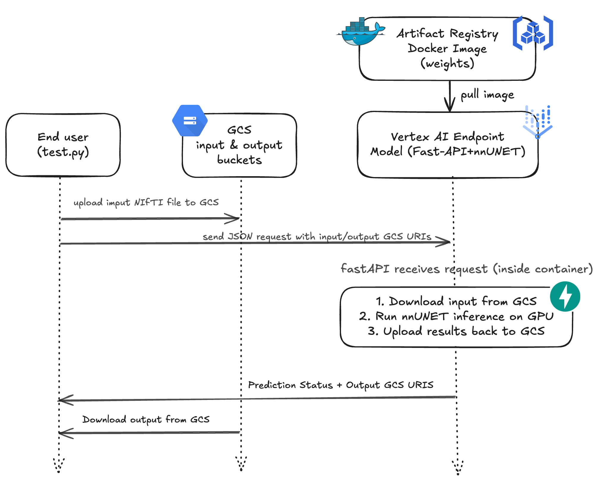

# 🧠 nnU-Net Inference API (FastAPI + Vertex AI + GCS)

## Introduction

This project provides a **FastAPI-based** API to perform inference on medical images using a custom trained **nnU-Net** on LUMIERE dataset.  
It can be run **locally** (via Docker) or deployed on **Vertex AI** (Google Cloud).

### Google Cloud Tools Used:
- **Google Cloud Storage (GCS)** to store and retrieve MRI volumes.
- **Artifact Registry** to store the Docker image containing the API and the weights.
- **Vertex AI** to deploy the model (nnU-Net + API) as an endpoint for inference.

---

### 📊 Application Workflow Diagram

Here is the general workflow of the application:



---

### 🚀 Key Features

- Automatically uploads and downloads NIfTI (`.nii.gz`) files from **Google Cloud Storage (GCS)**.
- Manages Docker images with **Artifact Registry**.
- Performs nnU-Net inference using GPU within a containerized model deployed on **Vertex AI**.
- Uploads inference results back to GCS.
- Easy local testing using Docker.
- Easy to use from any device to access the API endpoint for running inferences.

---

### 🗂️ Project Structure

```plaintext
📦 Project Root
│
├── data/                      
│   └── Folder containing the NIfTI (.nii.gz) image to segment
│
├── nnUNet_trained_models/    
│   └── Dataset001_LUMIERE/     Folder containing the nnU-Net model weights
│       ├── fold_0/             Contains weights (e.g., "checkpoint_final.pth")
│       ├── dataset_fingerprint.json
│       ├── dataset.json
│       └── plans.json
│
├── app.py                     FastAPI application
├── Dockerfile                 Docker image definition
├── test_local.py              Script for local testing
├── test_remote_endpoint.py    Script for testing on the Vertex AI endpoint
└── README.md                  This README file
```

---

## 📚 Tutorial for Deployment into Vertex AI

This section explains step-by-step how to deploy this project into **Google Vertex AI**.

---

### **Step 1 — Prepare the Environment**
```bash
# Check if you have gcloud CLI installed
gcloud version

# If not installed, follow this guide:
# https://cloud.google.com/sdk/docs/install

# Authenticate with Google Cloud
gcloud auth login

# Set your project ID
export PROJECT_ID="gemma-hcls25par-722"
gcloud config set project $PROJECT_ID

# Enable required APIs
gcloud services enable artifactregistry.googleapis.com
gcloud services enable aiplatform.googleapis.com
```

---

### **Step 2 — Create Artifact Registry Repository**
```bash
# Set your preferred region
export REGION="europe-west1"

# Create Artifact Registry repository
gcloud artifacts repositories create nnunet-models \
    --repository-format=docker \
    --location=$REGION \
    --description="Repository for nnU-Net models"

# Configure Docker authentication with Artifact Registry
gcloud auth configure-docker ${REGION}-docker.pkg.dev
```

---

### **Step 3 — Build & Push Docker Image**
```bash
# Build Docker image
export IMAGE_URI="${REGION}-docker.pkg.dev/${PROJECT_ID}/nnunet-models/nnunet-inference:v1"
docker build -t ${IMAGE_URI} .

# Push Docker image
docker push ${IMAGE_URI}
```

---

### **Step 4 — Create Model in Vertex AI**
```bash
gcloud ai models upload \
    --region=$REGION \
    --display-name="nnunet-lumiere-model" \
    --container-image-uri=$IMAGE_URI \
    --container-predict-route="/predict" \
    --container-health-route="/health" \
    --container-ports=8080
```

---

### **Step 5 — Deploy Model to Endpoint**
```bash
# Create endpoint
gcloud ai endpoints create \
    --region=$REGION \
    --display-name="nnunet-lumiere-endpoint"

# Get Endpoint ID & Model ID
gcloud ai endpoints list --region=$REGION
gcloud ai models list --region=$REGION

# Deploy the model (replace IDs with your actual values)
export ENDPOINT_ID="YOUR_ENDPOINT_ID"
export MODEL_ID="YOUR_MODEL_ID"

gcloud ai endpoints deploy-model $ENDPOINT_ID \
    --region=$REGION \
    --model=$MODEL_ID \
    --display-name="nnunet-deployment" \
    --machine-type="n1-standard-4" \
    --accelerator="type=nvidia-tesla-t4,count=1" \
    --min-replica-count=1 \
    --max-replica-count=2 \
    --traffic-split="0=100"
```

---

### 🧪 Local Testing
```bash
docker build -t my-nnunet-app .
docker run --rm -p 8080:8080 \
    -v ~/.config/gcloud:/root/.config/gcloud:ro \
    --gpus all \
    -e GOOGLE_CLOUD_PROJECT='gemma-hcls25par-722' \
    my-nnunet-app

# Run the local test script
python test_local.py
```

---

### ☁️ Test the Deployed Endpoint
```bash
# Run the remote endpoint test script
python test_remote_endpoint.py
```

---

### 📦 For New Deployment like END-USER (Quick Steps)
```bash
# Authenticate and set up your environment
gcloud auth login
gcloud config set project "gemma-hcls25par-722"
gcloud services enable artifactregistry.googleapis.com
gcloud services enable aiplatform.googleapis.com

# Authenticate locally for tests
gcloud auth application-default login  

# Test the deployed endpoint
python test_remote_endpoint.py
```

---

## 📄 License
MIT License

---

## 🙏 Acknowledgements
- nnU-Net by MIC-DKFZ.
- Google Cloud Platform for infrastructure.

##  Contact and more
- This part of the project was completly developped by Zoughebi Mateo (PhD Student).
- Tested by Rohit Datchanamourty on both linux and windows distribution.
- Contact : mateo.zoughebi@telecom-sudparis.eu.
